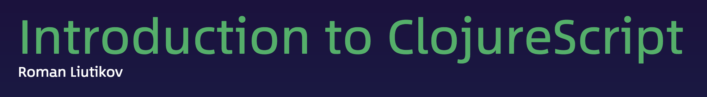

# [ClojureScript Workshop](https://reactiveconf.com/workshop/introduction-to-clojurescript) @ [ReactiveConf '17](https://reactiveconf.com/2017/)

Timing: 4hrs (1:00 PM - 5:00 PM)

## Requirements

It's nice to know the following:

- React.js
- Basics of functional programming

## Help during the workshop

Here's a couple of useful resources that will help you during the workshop:

- [ClojureScript Synonyms](https://kanaka.github.io/clojurescript/web/synonym.html) — translation of common things from JavaScript into ClojureScript
- [ClojureScript Cheatsheet](http://cljs.info/cheatsheet/) — a quick reference to a standard library of the language
- [ClojureDocs](https://clojuredocs.org/) — documentation website
- [Clojure Style Guide](https://github.com/bbatsov/clojure-style-guide) — a style guide to writing idiomatic Clojure code

## Agenda

- Intro into Lisp
- Intro into Clojure
- How to read Lisp code
- How to edit Lisp code
- Paredit and Parinfer editing modes
- Lectures & exercises

## Topics

- Syntax
- Variable declaration & local bindings
- Fighting parens: Threading macro
- Primitive data types
- Function declaration
- Control flow operators
- Data structures
- Operations on data structures
- Destructuring
- State
- Higher-order functions and stdlib (?)
- JavaScript interop
- Multimethods (?)
- Namespaces
- Exploring example app
- Building your own app from scratch

## Setup

No setup is needed! For this workshop we'll use online coding environments such as [Maria](https://www.maria.cloud/) and [Nightcoders](http://nightcoders.net/).

- [Maria Quickstart](https://www.maria.cloud/quickstart)

## Useful links

- [Community Resources](http://clojure.org/community/resources)
- [ClojureScript REPL](http://jaredforsyth.com/reepl/)
- [ClojureScript Synonyms](https://kanaka.github.io/clojurescript/web/synonym.html)
- [ClojureScript Cheatsheet](http://cljs.info/cheatsheet/)
- [ClojureScript API](http://cljs.github.io/api/)
- [ClojureDocs](https://clojuredocs.org/)
- [The Clojure Style Guide](https://github.com/bbatsov/clojure-style-guide)
- [Quickref for Clojure Core](https://clojuredocs.org/quickref)
- [ClojureScript Tutorial](https://www.niwi.nz/cljs-workshop/)
- [ClojureScript Koans](http://clojurescriptkoans.com/)
